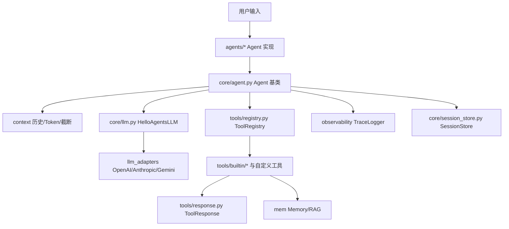
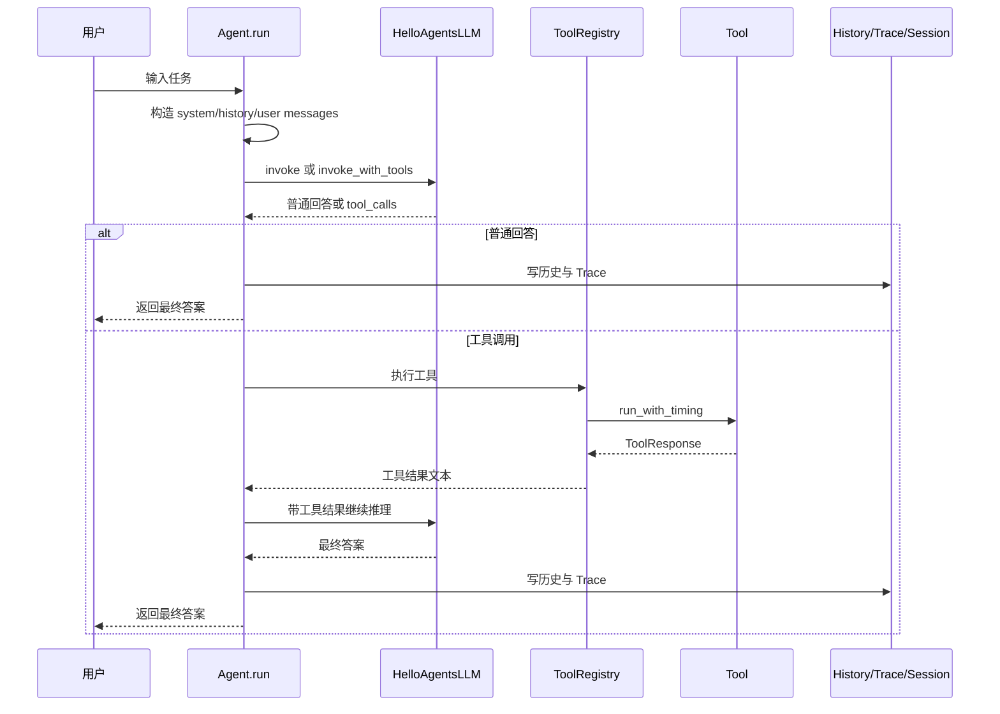
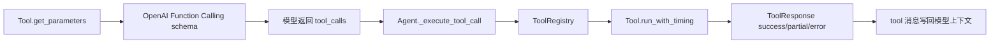
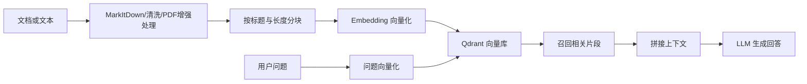

# 当前架构总览

本文描述 `/Users/wenzhilong/space/warehouse/agent_learning/hello-agents/HelloAgents` 当前集成版的模块结构和运行关系。

## 项目定位

当前项目是一个工程化 Agent 框架，不只是教程中的简单 Agent 示例。它围绕“模型调用、工具调用、上下文治理、记忆检索、运行记录、会话恢复”这些生产化问题组织代码，核心能力包括：

- 统一 LLM 调用入口：OpenAI 兼容、Anthropic、Gemini 三类适配。
- 多种 Agent 范式：Simple、ReAct、Reflection、PlanSolve。
- Function Calling 工具系统：工具 schema、参数转换、执行计时、三态响应、熔断。
- 上下文工程：历史压缩、Token 计数、工具输出截断。
- 记忆与 RAG：工作记忆、情景记忆、语义记忆、感知记忆、文档检索增强生成。
- 工程辅助能力：Trace、Session、Skills、Task 子代理、TodoWrite、DevLog、异步生命周期和流式输出。

## 项目形态

当前项目是一个顶层包布局的 Python Agent 框架，主要模块直接位于项目根目录：

```text
HelloAgents/
├── agents/          # Agent 范式实现
├── core/            # LLM、Agent 基类、配置、消息、生命周期、会话
├── context/         # 历史压缩、Token 计数、上下文构建、工具输出截断
├── tools/           # 工具协议、注册表、内置工具、熔断器、工具过滤
├── mem/             # 记忆系统与 RAG，已合并原 upstream memory 包
├── observability/   # TraceLogger，可输出 JSONL 和 HTML
├── skills/          # SkillLoader 与内置 Skills 目录
├── protocols/       # MCP/A2A/ANP 协议实现与工具包装
├── evaluation/      # BFCL、GAIA、数据生成等评测模块
├── rl/              # RL 数据集、奖励函数、训练器和工具
├── examples/        # 示例脚本
├── test/            # 当前测试目录
└── docs/            # 文档
```

当前目标项目不再保留单独的 `hello_agents/` 包目录。运行本地代码时通常需要将项目根加入 `PYTHONPATH`：

```bash
export PYTHONPATH=/Users/wenzhilong/space/warehouse/agent_learning/hello-agents/HelloAgents
```

## 整体架构图



可以把当前项目理解为五层：

- `core/`：统一模型接口、Agent 基类、配置、消息、生命周期和会话存储。
- `agents/`：具体智能体策略，决定如何组织推理步骤。
- `tools/`：模型可调用的外部能力，统一成 Function Calling schema 和 `ToolResponse`。
- `context/`：控制上下文长度、历史压缩和工具输出体积。
- `mem/`、`observability/`、`skills/` 等增强层：提供长期知识、运行可观测性和技能外化。

## 核心数据流

典型 `Agent.run()` 流程如下：

```text
用户输入
  ↓
Agent 构造 messages
  ↓
HelloAgentsLLM 调用模型
  ↓
可选 Function Calling 工具调用
  ↓
ToolRegistry 执行 Tool.run_with_timing()
  ↓
ToolResponse 写回模型上下文
  ↓
Agent 保存历史、Trace、Session 元数据
  ↓
最终答案
```

对应到代码层，核心调用链是：

1. 外部代码创建 `HelloAgentsLLM`、`ToolRegistry` 和某个 Agent。
2. Agent 在 `run()` 中构造 `system/history/user` messages。
3. 普通回答走 `HelloAgentsLLM.invoke()`；需要工具调用时走 `HelloAgentsLLM.invoke_with_tools()`。
4. 模型返回 `LLMResponse` 或 `LLMToolResponse`。
5. 若存在 `tool_calls`，Agent 调用 `_execute_tool_call()`。
6. `_execute_tool_call()` 通过 `ToolRegistry` 找到工具，执行 `Tool.run_with_timing()`。
7. 工具返回 `ToolResponse`，Agent 将 `response.text` 作为工具结果写回 messages。
8. Agent 继续调用模型，直到得到最终回答或达到最大迭代次数。
9. Agent 记录 history、trace、session metadata，最后返回字符串答案。

## Agent 运行时序



## Core 层

- `core/llm.py`：`HelloAgentsLLM`，统一 LLM 入口。
- `core/llm_adapters.py`：OpenAI 兼容、Anthropic、Gemini 三类适配器。
- `core/llm_response.py`：`LLMResponse`、`LLMToolResponse`、`ToolCall`、`StreamStats`。
- `core/agent.py`：`Agent` 基类，集成历史压缩、工具 schema、子代理、Session、Trace、Skills、TodoWrite、DevLog。
- `core/config.py`：`Config`，集中配置上下文、工具、会话、Trace、Skills、流式和异步行为。
- `core/message.py`：`Message`，支持 `user/assistant/system/tool/summary` 角色。
- `core/session_store.py`：会话保存、恢复和一致性检查。
- `core/lifecycle.py`、`core/streaming.py`：异步生命周期和流式事件。

`HelloAgentsLLM` 的配置优先级是“显式参数 > 新环境变量 > 旧环境变量”：

- 新环境变量：`LLM_MODEL_ID`、`LLM_API_KEY`、`LLM_BASE_URL`、`LLM_TIMEOUT`
- 旧环境变量：`MODEL_ID`、`API_KEY`、`BASE_URL`
- 兼容参数：`app_id` 等价于 `api_key`

Adapter 选择逻辑主要由 `base_url` 决定：

- 默认走 OpenAI 兼容接口，适用于 OpenAI、DeepSeek、Qwen、Kimi、智谱、Ollama、vLLM 等。
- URL 包含 Anthropic 特征时走 Anthropic Adapter。
- URL 包含 Google Generative Language 特征时走 Gemini Adapter。

## Agent 层

- `SimpleAgent`：基础对话 Agent，支持可选 Function Calling 工具调用。
- `ReActAgent`：基于 Function Calling 的推理与行动 Agent，内置 `Thought` 和 `Finish` 语义。
- `ReflectionAgent`：初稿、反思、优化的迭代 Agent，可选工具调用。
- `PlanSolveAgent` / `PlanAndSolveAgent`：先规划再逐步执行。
- `FunctionCallAgent`、`ToolAwareAgent`：保留的历史/兼容实现。
- `agents/factory.py`：子代理工厂，供 `TaskTool` 使用。

几类 Agent 的工作差异：

| Agent | 核心流程 | 适用场景 |
| --- | --- | --- |
| `SimpleAgent` | 直接对话；可选多轮 Function Calling | 普通问答、简单工具调用 |
| `ReActAgent` | 多步循环；模型可调用 `Thought`、业务工具、`Finish` | 需要边推理边行动的任务 |
| `ReflectionAgent` | 初始执行 -> 反思 -> 优化，循环到满意或达到上限 | 代码生成、文档写作、分析报告 |
| `PlanSolveAgent` | 先强制生成计划，再逐步执行计划 | 多步骤推理、复杂任务拆解 |

`ReActAgent` 当前不再依赖正则解析 `Thought/Action` 文本，而是基于 Function Calling 的结构化工具调用，因此工具名和参数解析更稳定。

## Tool 层

工具系统以 `ToolResponse` 为统一协议：

- `tools/base.py`：`Tool`、`ToolParameter`、`tool_action`。
- `tools/registry.py`：`ToolRegistry`，负责注册、执行、熔断保护、函数工具兼容。
- `tools/response.py`：`success/partial/error` 三态响应。
- `tools/errors.py`：标准错误码。
- `tools/circuit_breaker.py`：按工具维度熔断连续失败。
- `tools/tool_filter.py`：子代理场景下的工具访问控制。

工具协议的核心目标是让所有外部能力都能以稳定结构返回给 Agent：



`ToolResponse` 字段含义：

- `status`：`success`、`partial`、`error` 三态。
- `text`：给 LLM 继续阅读的文本。
- `data`：结构化数据载荷。
- `error_info`：错误码和错误消息。
- `stats`：耗时、Token 等统计。
- `context`：输入参数、工具名等上下文。

常用内置工具包括：

- 文件：`Read`、`Write`、`Edit`、`MultiEdit`
- 任务：`Task`、`TodoWrite`、`DevLog`
- 知识：`Skill`、`memory`、`rag`
- 搜索与浏览：`search`、`web_browser`
- 协议：`MCPTool`、`A2ATool`、`ANPTool`
- 评测与训练：`bfcl_evaluation`、`gaia_evaluation`、`llm_judge_evaluation`、`win_rate_evaluation`、`rl_training`

## Context 层

`context/` 负责让长任务可控：

- `HistoryManager`：按轮次压缩历史，生成 `summary` 消息并保留最近 N 轮。
- `TokenCounter`：缓存消息 Token 数，支持增量统计。
- `ObservationTruncator`：截断超长工具输出，并将完整输出保存到 `tool-output/`。
- `ContextBuilder`：整理系统提示词、历史、工具结果和额外上下文。

压缩触发条件来自：

```python
Config.context_window * Config.compression_threshold
```

超过阈值后，`Agent.add_message()` 会触发 `_compress_history()`。

历史压缩的基本策略是：旧消息被替换成一条 `summary` 消息，同时保留最近 `Config.min_retain_rounds` 轮完整对话。这样可以减少上下文长度，同时尽量保留最近决策和工具结果。

## Memory 与 RAG

当前只保留 `mem/` 作为记忆系统包：

- `mem/manager.py`：统一管理工作记忆、情景记忆、语义记忆、感知记忆。
- `mem/types/working.py`：短期工作记忆。
- `mem/types/episodic.py`：情景记忆，结合 SQLite 与向量检索。
- `mem/types/semantic.py`：语义记忆，结合 Qdrant 与 Neo4j。
- `mem/types/perceptual.py`：多模态感知记忆，CLIP/CLAP 默认不自动下载。
- `mem/storage/`：SQLite、Qdrant、Neo4j 存储适配。
- `mem/rag/`：文档处理、分块、向量索引、扩展查询、重排和片段合并。

工具入口是 `tools.builtin.MemoryTool` 和 `tools.builtin.RAGTool`。

MemoryTool 面向 Agent 暴露以下动作：

- `add`：添加一条记忆。
- `search`：检索相关记忆。
- `summary`：返回记忆摘要。
- `stats`：返回记忆统计。
- `update`、`remove`：更新或删除记忆。
- `forget`：按重要性、时间或容量遗忘。
- `consolidate`：把高重要性的短期记忆整合到长期记忆。
- `clear_all`：清空记忆。

RAGTool 面向知识库暴露以下动作：

- `add_document`：读取并索引文档。
- `add_text`：索引一段文本。
- `ask`：检索相关片段并调用 LLM 生成回答。
- `search`：只返回检索片段。
- `stats`：查看知识库统计。
- `clear`：清理知识库。

RAG 的核心流程如下：



其中 `mem/rag/pipeline.py` 负责文档转换、PDF 后处理、分块、索引、检索、扩展查询和片段合并；`tools/builtin/rag_tool.py` 则负责把这些能力包装成 Agent 可调用工具。

## 外部依赖与配置

基础 LLM 配置：

```bash
LLM_MODEL_ID=your-model
LLM_API_KEY=your-key
LLM_BASE_URL=https://your-openai-compatible-endpoint/v1
LLM_TIMEOUT=60
```

兼容旧变量：

```bash
MODEL_ID=your-model
API_KEY=your-key
BASE_URL=https://your-openai-compatible-endpoint/v1
```

可选服务：

- Qdrant：`QDRANT_URL`、`QDRANT_API_KEY`
- Neo4j：`NEO4J_URI`、`NEO4J_USER`、`NEO4J_PASSWORD`
- Embedding：`EMBED_MODEL_TYPE`、`EMBED_MODEL_NAME`、`EMBED_API_KEY`、`EMBED_BASE_URL`
- 搜索：`TAVILY_API_KEY`、`SERPAPI_API_KEY`

## 默认运行产物

- Trace：`memory/traces/*.jsonl`、`memory/traces/*.html`
- Session：`memory/sessions/*.json`
- TodoWrite：`memory/todos/*`
- DevLog：`memory/devlogs/*`
- 长工具输出：`tool-output/*`

如不希望测试或示例写入这些目录，可以在 `Config` 中关闭对应能力或改写目录。

## 关键兼容点

- `PlanAndSolveAgent` 是 `PlanSolveAgent` 的兼容别名。
- `HelloAgentsLLM` 支持 `app_id` 作为 `api_key` 的兼容参数。
- `test/conftest.py` 会加载最近的 `.env`，并将 `MODEL_ID/API_KEY/BASE_URL` 映射到 `LLM_MODEL_ID/LLM_API_KEY/LLM_BASE_URL`。
- `mem` 是当前记忆系统包；不要再新增 `memory` 运行时代码路径。

## 阅读源码建议

想快速理解当前项目，可以按下面顺序阅读：

1. `README.md`：先了解项目定位和能力清单。
2. `docs/current-architecture.md`：看模块边界和运行流程。
3. `core/llm.py`、`core/llm_adapters.py`：理解模型调用入口。
4. `core/agent.py`：理解 Agent 基类如何挂载上下文、工具、Trace 和 Session。
5. `agents/simple_agent.py`、`agents/react_agent.py`、`agents/reflection_agent.py`、`agents/plan_solve_agent.py`：理解不同 Agent 范式。
6. `tools/base.py`、`tools/registry.py`、`tools/response.py`：理解工具协议。
7. `context/history.py`、`context/token_counter.py`、`context/truncator.py`：理解上下文工程。
8. `mem/manager.py`、`tools/builtin/memory_tool.py`、`tools/builtin/rag_tool.py`、`mem/rag/pipeline.py`：理解记忆和 RAG。
